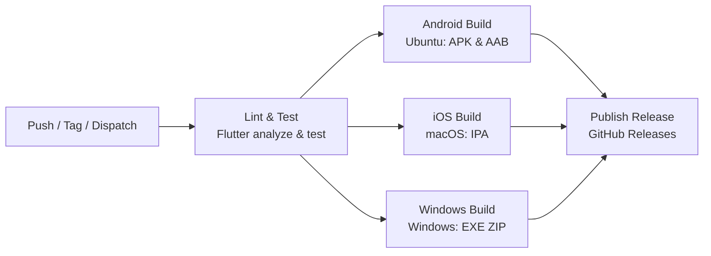

# CafeVerse Multiplatform GitHub CI/CD Pipeline

This repository is equipped with an automated Continuous Delivery (CD) workflow using GitHub Actions ([.github/workflows/cd.yml](workflows/cd.yml)).

It automatically builds, packages, and releases for **Android (APK & AAB)**, **iOS (IPA)**, and **Windows (EXE / ZIP)**.

---

## 🚀 Pipeline Architecture



---

## 📦 Generated Platform Artifacts

| Platform    | Format / File                     | Description                                                                           |
| ----------- | --------------------------------- | ------------------------------------------------------------------------------------- |
| **Android** | `cafeverse-universal-release.apk` | Universal APK compatible with all Android devices                                     |
| **Android** | `app-arm64-v8a-release.apk`       | Optimized APK for modern 64-bit ARM phones                                            |
| **Android** | `app-armeabi-v7a-release.apk`     | Optimized APK for older 32-bit ARM phones                                             |
| **Android** | `app-x86_64-release.apk`          | Optimized APK for x86_64 devices & emulators                                          |
| **Android** | `cafeverse-release.aab`           | App Bundle for Google Play Store distribution                                         |
| **iOS**     | `cafeverse-ios.ipa`               | Packaged iOS IPA binary for device deployment / sideloading / TestFlight              |
| **Windows** | `cafeverse-windows-x64.zip`       | Compressed Windows desktop bundle containing `cafeverse_flutter.exe` and runtime DLLs |

Artifacts are retained for **30 days** in the GitHub Actions run summary.

---

## 🏷️ How to Trigger a Release

### Method 1: Git Tag (Recommended)

Pushing any tag starting with `v` triggers compilation across all OS runners and creates a unified GitHub Release:

```bash
git tag v1.0.0
git push origin v1.0.0
```

### Method 2: Manual Trigger via GitHub UI

1. Go to the **Actions** tab in your GitHub repository.
2. Select **CafeVerse Multiplatform CD Pipeline**.
3. Click **Run workflow**.
4. Choose target platforms and check **Create GitHub Release** (`true`), then click **Run workflow**.

---

## 🔐 Optional Signing Secrets (Repository Secrets)

If you want production keystore signing for Android, configure the following secrets under **Repository Settings > Secrets and variables > Actions**:

- `ANDROID_KEYSTORE_BASE64`: Base64 encoded `.jks` file (`base64 -w 0 upload-keystore.jks`)
- `ANDROID_KEYSTORE_PASSWORD`: Keystore password
- `ANDROID_KEY_PASSWORD`: Key password
- `ANDROID_KEY_ALIAS`: Key alias
